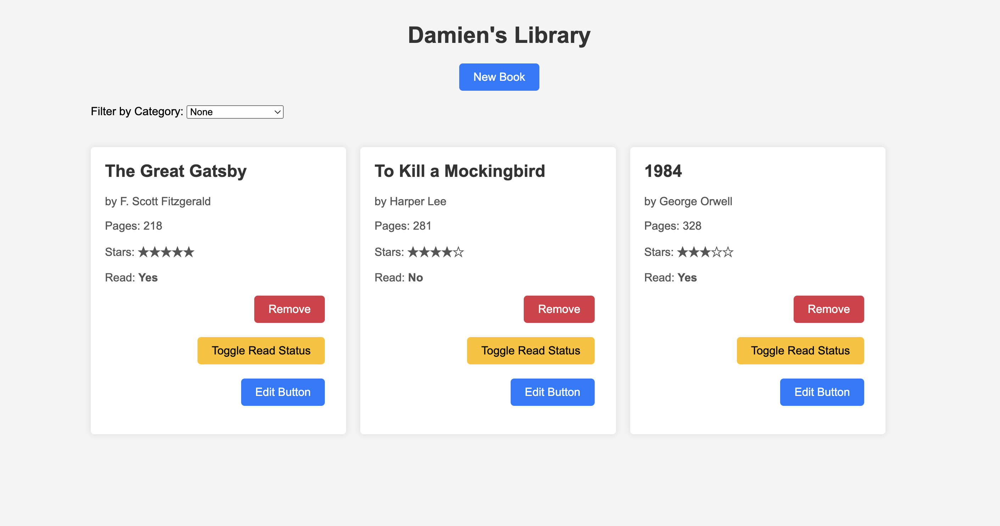
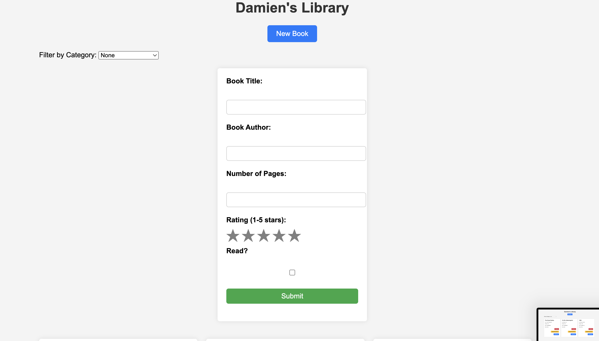
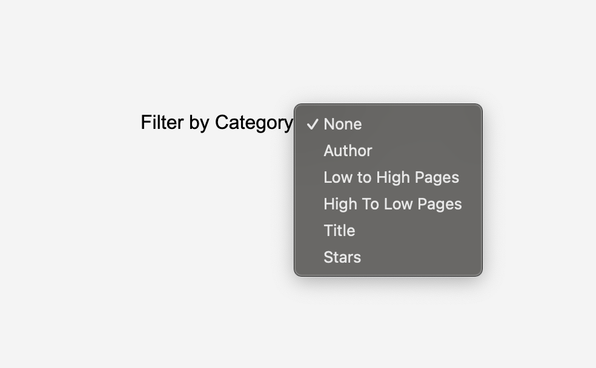

# library-odin

# Library Project
# This is the project that can be found in the Odin project under the javscript unit and in chapter "Organizing your javascript code"

# Screenshot of application

# Screenshot of new book form

# Screenshot of filter usage

# Technologies used:
## Javascript
## HTML
## CSS

# Features Implemented:
## Required: 
### Book objects stored in an array
### Display function using loop
### Add new book functionality (author, title, pages, wether it has been read)
### Remove functionality
## Additional I Did:
### Stars rating for a user to give
### Edit functionality for each book
### Filter functionality (title, pages (high to low, low to high), rating, none, author)

# Usage Guidelines:
## Write this

# Future Improvements Planned:
## Maybe use of pictures to be allowed.
## Write some more below

# Learning Outcomes:
## How to make my code look better.
## Using objects in JS
## Write some more below

<!-- 
Tasks To-Do:
1. add a function to the script that takes in arguements, store new book object to an array, and create a book from those arguments +++
2. wite a fucntion tha loops thorugh and displays each book +++
3. New book button that opens a form for the user to fill out +++
4. Add a button on each book’s display to remove the book from the library. +++
5. Add a button on each book’s display to change its read status. +++
6. Add a drop down to sort through library based on different filters +++
7. Add an edit option for the user to edit a specific book +++
8. Add a ratings option for user +++

-->
